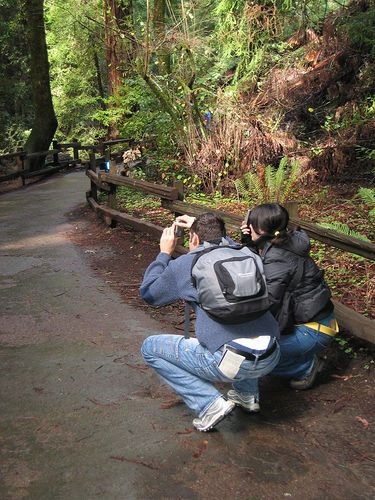
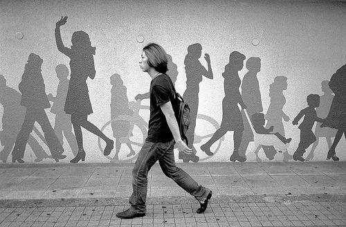
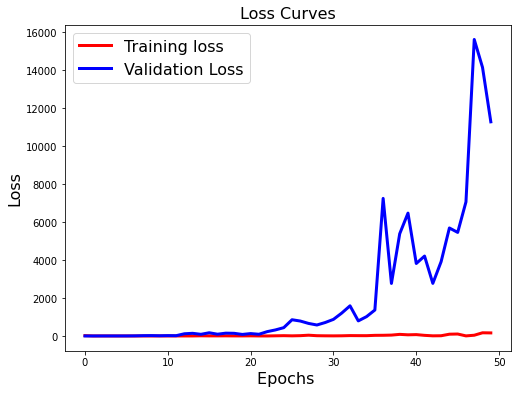
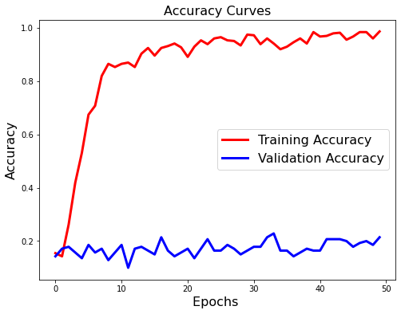
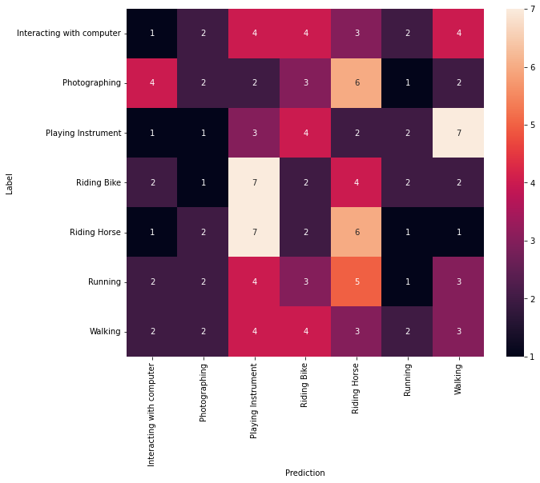
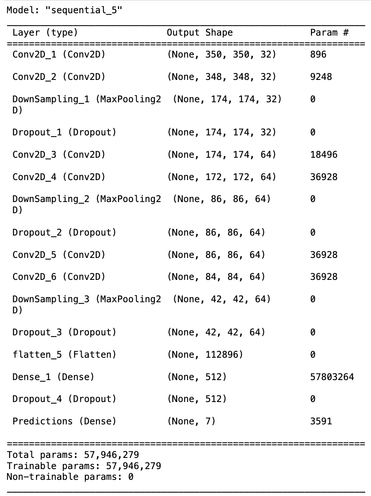

# human-action-recognition
Human action recognition in photographs / still images [work in progress].

Versions:
- Keras using JupyterLab
- Matlab (obsolete)

## Motivation

Human action recognition is a standard Computer Vision problem and has been well studied in video interpretation/ understanding. But some actions in video are static by nature ("taking a photo") and only require recognition methods based on static cues. In this project, I propose an AI algorithm/ CNN model to recognise seven human actions using a photograph.

Human actions/ classes:
1. Interacting with computer,
2. Photographing,
3. Playing Instrument,
4. Riding Bike,
5. Riding Horse,
6. Running,
7. Walking.

## Dataset - examples

Dataset of 560 color images of size 500 x 500 (landscape and portrait formats).
- Training set: 420
- Test set: 140

|||||
|-|-|-|-|
|| | | |
|Interacting with computer |Photographing |Playing Instrument |Riding Bike |
|| | | |
|Riding Horse |Running |Walking | |

## Model architecture & performance

### V2 - In progress - Validation accuracy: X %

Updated model architecture based on V1 flaws (see "Model architecture"). Added a validation set different from the test test by splitting the training set.

    Optimizer: RMSProp
    Loss: categorical cross-entropy
    Metrics: categorical accuracy

#### Model architecture

Modifications:
- 6 to 4 convolution layers
- Regularization -> added an L2 kernel regularizer on convolutional layers with a learning rate of 0.01
- Dropout regularization -> updated rates:
    - hidden layers: rate of 0.4 (instead of 0.25)
    - output layer: rate of 0.2 (instead of 0.5)
- Weight initialization
- Weight constraints

## V1 - Overfitted - Validation accuracy: 20%

    Optimizer: RMSProp
    Loss: categorical cross-entropy
    Metrics: categorical accuracy

|Training Accuracy|Training Loss|Validation Accuracy|Validation Loss|
|-|-|-|-|
|86,22 %|25.69|17,24 %|2170.73|

(*) Averages/ mean values over 50 epochs

#### Loss and accuracy curves

|Loss|Accuracy|
|-|-|
|||

Confusion matrix:

Clear overfitting. The model appears to be too complex for the task. Possible causes:
- too many filters,
- disproportionated training and test sets: no validation set, test set used for validation and testing -> split the data using the 70/10/20 ratio: 70% training, 10% validation, 20% test

Possible solutions:
- Regularization -> use a kernel regularizer on convolutional layers to simplify the network and minimize loss.
- Dropout regularization -> ignore a random subset of units in a layer during training (weights set to zero) to minimize the network's complexity.
- Weight initialization -> set neurons' weights before training to reduce the time needed to get to the global minimum of our loss function / kernel initializer.
- Weight constraints -> set a limit to the size of the network weights (magnitude) / kernel constraint.
- Data augmentation: increase the size of the training set -> generate more data without altering the original images (rotation, shift, scale, zoom, flip).
- Increase the image resolution -> use full size (500x500) instead of 350x350.

#### Model architecture

6 encoding layers followed by down sampling layers (max pooling), dropout layers to avoid overfitting. Classifier composed of a dense/ fully connected layer + a softmax output layer of 7 units for all 7 classes.

