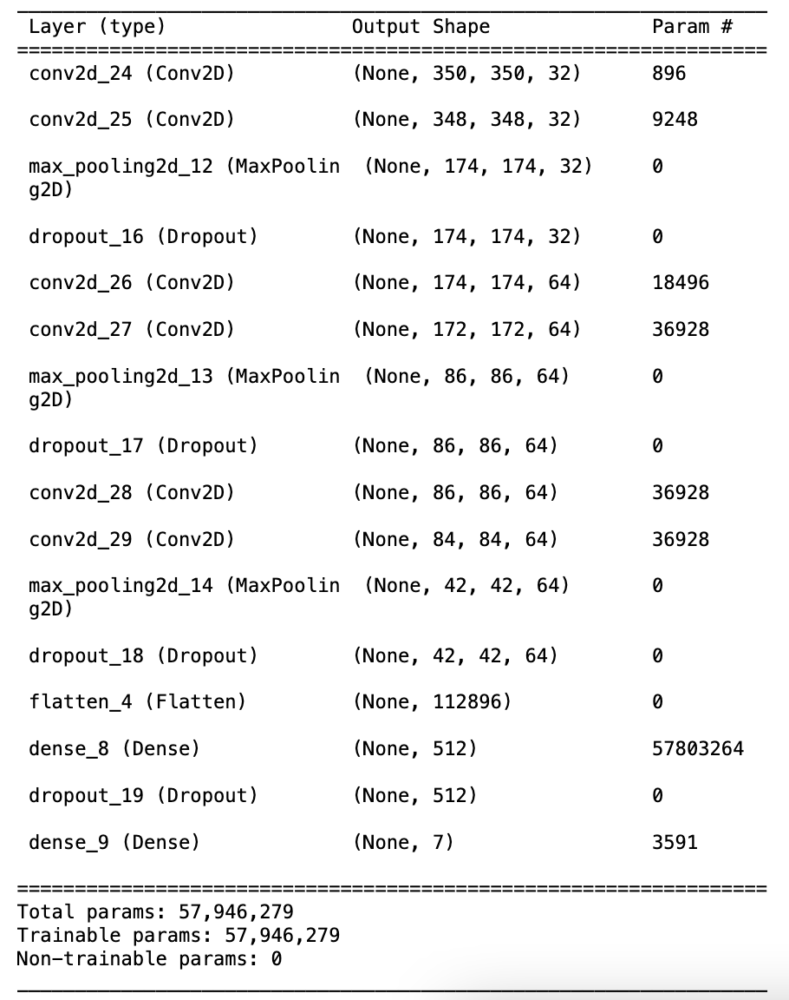

# human-action-recognition
Human action recognition in photographs / still images

Versions:
- Keras using JupyterLab
- Matlab (obsolete)

## Motivation

Human action recognition is a standard Computer Vision problem and has been well studied in video interpretation/ understanding. But some actions in video are static by nature ("taking a photo") and only require recognition methods based on static cues. In this project, I propose an AI algorithm to recognize seven human actions using a photograph.

Actions:
1. Interacting with computer,
2. Photographing,
3. Playing Instrument,
4. Riding Bike,
5. Riding Horse,
6. Running,
7. Walking.

## Dataset - examples

|||||
|-|-|-|-|
|| | | |
|Interacting with computer |Photographing |Playing Instrument |Riding Bike |
|| | | |
|Riding Horse |Running |Walking | |

## Model architecture

